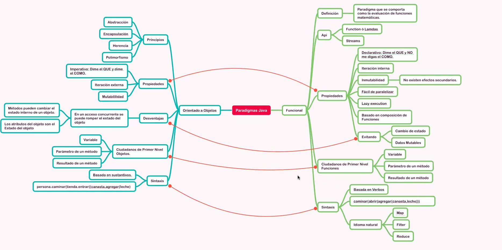
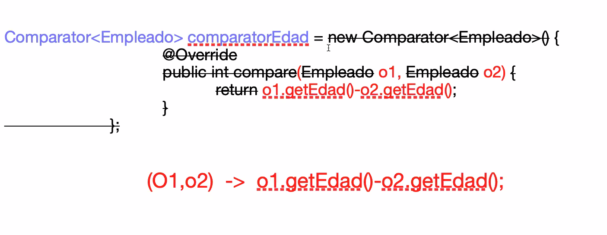
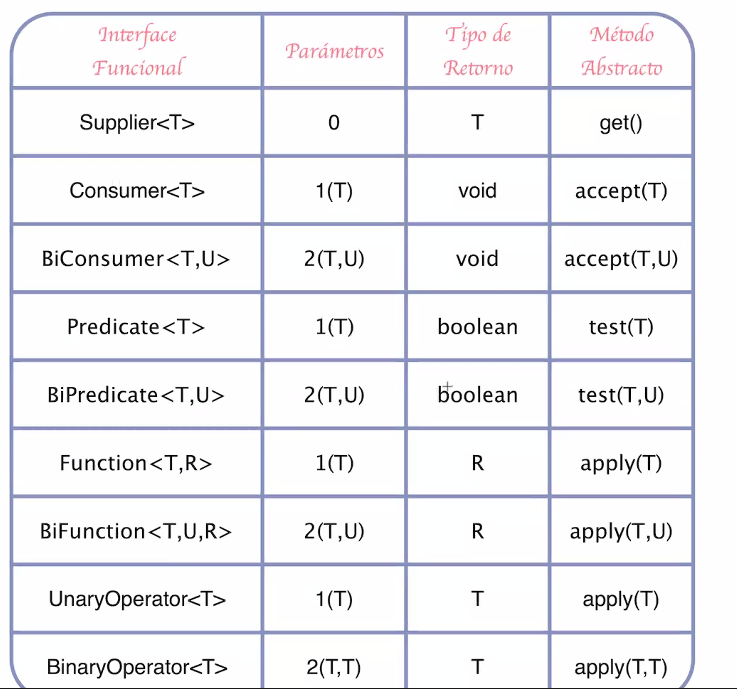

# Capitulo 6 - Programacion Funcional

## intro


- Spring 5 toma programacion reactiba y lo pone en spring web flux.
- Lisp primer lenguaje funcional 1958


POO  vs  Funcional

 


## Ejercicio para comparar POO con Funcional


 ``` 
public  Empleado {
    private String name ;
    private int edad ;
    private double sueldo;

// with setters , getters and constructor 
}
```


###  con POO :
```java 
class ComparatorEdad implements Comparator <Empleado> {

    @Override
    public int compare(Empleado e1, Empleado e2){
          // return e1.getEdad() - e2.getEdad();

        if (e1.getEdad() > e2.getEdad()){
            return 1;
        } else if (e1.getEdad() < e2.getEdad()){
            return -1;
        } else {
            return 0;
        }

    }

}

public class Main{

    public static void main (String args []){
        List<Empleado> empleadoList = new ArraysList<>();
        empleadoList.add(new Empleado("Anibal",32));
        empleadoList.add(new Empleado("luis",33));
        empleadoList.add(new Empleado("Nelly ", 24));
        empleadoList.add(new Empleado("Edus ",22));
        empleadoList.add(new Empleado("Licho",21));

        for (Empleado temp : empleadoList){
            System.out.println(temp);
        }


        Collection.sort(empleadoList , new ComparatorEdad() );

        for (Empleado temp : empleadoList){
            System.out.println(temp);
        }
    }
}


```


sustituimos  la clase de comparacion y lo escribimos como lamda




Ejercicio Programacion Funcional

```java
 
public class Main{

    public static void main (String args []){
        List<Empleado> empleadoList = new ArraysList<>();
        empleadoList.add(new Empleado("Anibal",32));
        empleadoList.add(new Empleado("luis",33));
        empleadoList.add(new Empleado("Nelly ", 24));
        empleadoList.add(new Empleado("Edus ",22));
        empleadoList.add(new Empleado("Licho",21));

        Comparator<Empleado> comparadorEdad = (o1,o2)-> o1.getEdad() - o2.getEdad();


         Collection.sort(empleadoList , comparadorEdad );
        for (Empleado temp : empleadoList){
            System.out.println(temp);
        }
    }
}

```

para definir una lambda  se tiene que conciderar los siguintes puntos

- conocer la interface .
- conocer el metodo abstracto que queremos.


```java  
//para comparar por Nombre 


// clase anonima 

Comparator<Empleado> comparaNombre = new Comparator<Empleado> {

    @Override
    public int compare(Empleado o1, Empleado o2){
        return o1.getName().compareTo(o2.getName());
    }

}

Collection.sort(empleadoList , comparaNombre );


 // lambda 

Comparator<Empleado> comparaNombre = (o1, 02) -> o1.getName().compareTo(o2.getName())
Collection.sort(empleadoList , comparaNombre );

```

la anotación *@FunctionalInterface* que obliga al desarrollador a solo incluir un método abstracto.

```java
@FunctionalInterface
public interface Predicado<T> {

 boolean probar(T t);
}
```

### Tabla de Interfaces Funcionales



Ejemplo  Consumer 

```java 
Consumer<Empleado> consumer2 = x -> System.out.println(x.toString());
        consumer2.accept(new Empleado("Anibal",32, 5)); // Empleado{name='Anibal', edad=32, salario=5.3}
```

Ejemplo Supplier 
```java 
 Supplier<Empleado> supplier1 = () -> new Empleado("Anibal",32, 5.30);
  Empleado emp = supplier1.get();
  System.out.println(emp);// Empleado{name='Anibal', edad=32, salario=5.3}
```

Ejemplo Function
```java
Function<String ,Integer> function1 = x -> x.length();
int size =  function1.apply("Hola Mundo");
System.out.println(size); // 10


Function<Empleado, String > function2 = x-> x.getName();
String name = function2.apply(new Empleado("Anibal", 32 , 5.50));
System.out.println(name); //Anibal
```

Ejemplo UnaryOperator

```java

Function<String, String >  function3 = x-> x + " Mundo";    // Function
System.out.println(function3.apply("Hola"));

UnaryOperator<String> unaryOperator = x-> x + " Mundo";  //UnaryOperator
System.out.println(unaryOperator.apply("Hola"));


List<Empleado> empleadoList = new ArrayList<>();
empleadoList.add(new Empleado("Luis",34, 10));
empleadoList.add(new Empleado("Anibal",32, 5.3));
empleadoList.add(new Empleado("Nelly",24, 20));

UnaryOperator<Empleado> unaryOperator1 = x-> {
x.setName("lic " + x.getName());
return x;
};
empleadoList.replaceAll(unaryOperator1);
empleadoList.forEach(x-> System.out.println(x));
```

## Metodos Reference 

Existen 4 formas de metodos references

* SomeClass:StaticMethod 
   - x -> Math.cos(x)   - lambda
   - Math::cos          - metodoreference
```java
BiPredicate<Integer, Integer>  esMas10 = (x,y) ->  Numeros.esMayor10(x,y);
boolean result = esMas10.test(4,5);
System.out.println(result);

BiPredicate<Integer, Integer>  esMas11 = Numeros::esMayor10;
boolean result2 = esMas11.test(10,5);
System.out.println(result2);
```


* SomeClass::new
  - ()-> new SomeClass()  - lambda
  - SomeClass::new  - metodoreference
  
```java
Supplier<Persona> supplier = Persona::new;
Persona result = supplier.get();
System.out.println(result);

Function<Integer, Persona> function = Persona::new;
Persona persona2 = function.apply(32);
System.out.println(persona2);

BiFunction<Integer, String, Persona> biFunction = Persona::new;
Persona persona3 = biFunction.apply(32, "Anibal");
System.out.println(persona3);
```

* SomeObject:: InstanceMethod 
 